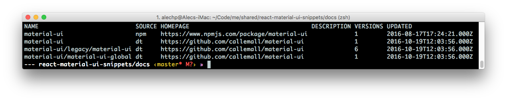

<h1>Intellisense</h1>

Typings is a "TypeScript Definition Manager". Think: "npm for intellisense". 

-------

<h2>Getting Started</h2>
1. Install typings
```
npm install typings --global
```

2. Install material UI typescript definition
```
typings install dt~material-ui --global
```


<h3>Installing from Specific Source</h3>
Typings allows you to install from multiple dependency sources (think: JSPM). 
In the Getting Started section above, we use the `sourceName~` syntax to designate which source.

<h4>How did we get the 'material-ui' name?</h4> 
```
typings search material-ui
```

This will print a result like so:


------------

<h4>Ref - Sources</h4>
| Name | Description | 
|:-----|:------------|
| npm | dependencies from NPM
| github | dependencies directly from GitHub (E.g. Duo, JSPM)
| bitbucket | dependencies directly from Bitbucket
| bower | dependencies from Bower
| common | "standard" libraries without a known "source"
| shared | shared library functionality
| lib | shared environment functionality (mirror of shared) (--global)
| env | environments (E.g. atom, electron) (--global)
| global | global (window.<var>) libraries (--global)
| dt | typings from DefinitelyTyped (usually --global)